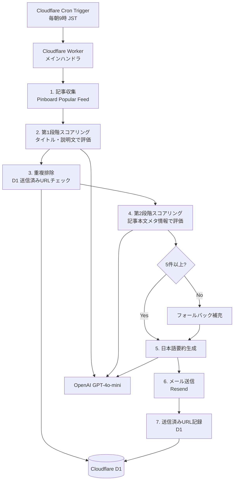
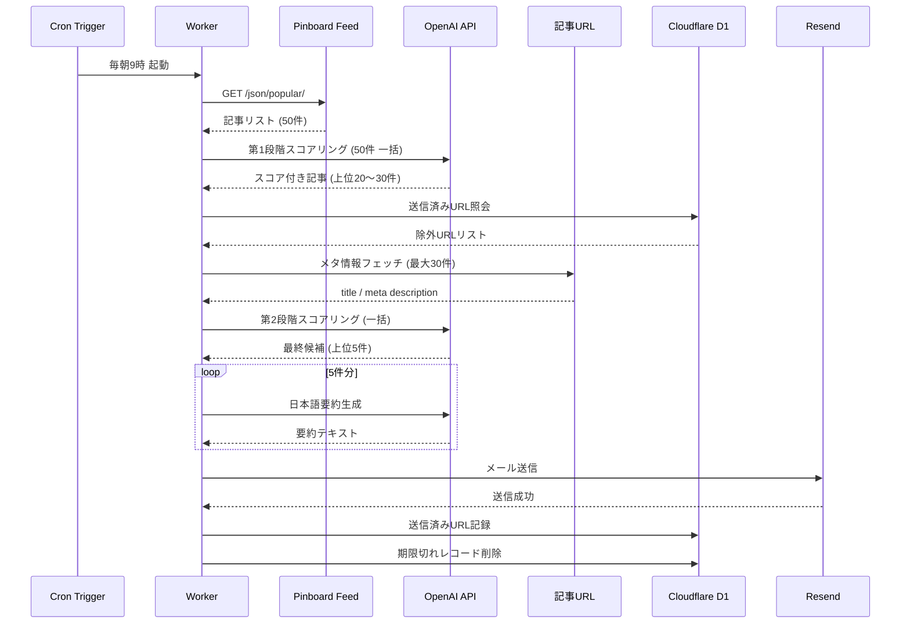

# 機能設計書

## システム全体構成図



## 機能ごとのアーキテクチャ

### 1. 記事収集

**処理概要：** Pinboard のパブリック Popular フィードから記事を取得する。

**入力：** なし（Cron Trigger により起動）

**出力：** 記事リスト（最大50件）

```
記事オブジェクト {
  url: string
  title: string
  description: string
  tags: string[]
}
```

**処理フロー：**

1. `https://feeds.pinboard.in/json/popular/` に GET リクエストを送信
2. レスポンスをパースし、記事オブジェクトの配列を生成
3. 失敗時は1回リトライ。再失敗時はエラーログを記録して処理中断

---

### 2. 第1段階スコアリング（事前フィルタリング）

**処理概要：** フィードの title / description のみを使い、Webフロントエンド関連度を評価する。サブリクエストを消費しない。

**入力：** 記事リスト（最大50件）

**出力：** スコア付き記事リスト（上位20〜30件）

**OpenAI 呼び出し仕様：**

- モデル：`gpt-4o-mini`
- 入力：全記事のタイトル・説明文を一括送信（バッチ処理）
- 出力：各記事に対するスコア（0〜10）と判定理由

**スコアリング基準（システムプロンプト）：**

高評価（7〜10点）：
- JavaScript / TypeScript の新機能・ベストプラクティス
- React / Next.js / Vue 等フレームワーク関連
- CSS・ブラウザ API・パフォーマンス最適化
- Vite / esbuild 等ツールチェーン

低評価・除外（0〜3点）：
- マーケティング・採用・SEO目的
- バックエンド・インフラ中心の内容

**選出ロジック：**

- スコア上位20〜30件を候補として次段階に渡す
- スコアが同点の場合はフィード順（人気順）を優先

---

### 3. 重複排除

**処理概要：** 過去90日間に送信済みの記事URLを D1 で管理し、重複を除外する。

**タイミング：** 第1段階スコアリング後・第2段階スコアリング前に実施（フェッチ対象を絞るため）

**D1 テーブル定義：**

```sql
CREATE TABLE sent_articles (
  url TEXT PRIMARY KEY,
  sent_at TEXT NOT NULL  -- ISO 8601 形式
);
```

**重複排除ロジック：**

1. 候補URLリストを D1 に問い合わせ、`sent_articles` に存在するURLを取得
2. 候補リストから送信済みURLを除外
3. 保持期間（90日）を超えたレコードを定期的に削除

**保持期間管理：**

- 毎回の実行時に `sent_at < NOW() - 90days` のレコードを削除する

---

### 4. 第2段階スコアリング（記事フェッチ＋最終選出）

**処理概要：** 候補記事のURLにアクセスし、メタ情報を取得したうえで最終スコアリングを行う。

**入力：** 重複排除後の候補記事（20〜30件）

**出力：** 最終候補記事（上位5件以上）

**記事フェッチ仕様：**

- 取得対象：`<title>` タグ、`<meta name="description">` タグ、記事本文テキスト
- 本文抽出：`<article>` → `<main>` → `<body>` の優先順位でテキストを取得し、先頭3,000文字に切り詰める
- タイムアウト：5秒
- 失敗時：該当記事をスキップ（エラーログ記録）
- サブリクエスト数：Cloudflare Workers Free プランの上限50件以内に収める
- フェッチ結果（title・description・本文）は要約生成フェーズで再利用する（追加フェッチなし）

**OpenAI 呼び出し仕様：**

- モデル：`gpt-4o-mini`
- 入力：フェッチ済みメタ情報（title + description）を一括送信（本文はスコアリングには使用せず、要約生成で再利用）
- 出力：各記事のスコア（0〜10）

**選出ロジック：**

- 最終スコア上位から5件を選出
- 5件未満の場合はフォールバック処理へ

---

### 5. フォールバック補充

**処理概要：** フロントエンド関連記事が5件に満たない場合、不足分をスコア上位の一般記事で補充する。

**入力：** 選出済みフロントエンド記事（1〜4件）、第1段階スコアリング結果（全件）

**出力：** 合計5件の記事リスト

**補充ロジック：**

1. 選出済み記事のURLを除外
2. 第1段階のスコア降順で不足件数分を補充
3. 補充記事はメール本文で区別しない（同列扱い）
4. 補充後も5件未満の場合は取得できた件数で処理を続行（0件の場合は処理をスキップ）

---

### 6. 日本語要約生成

**処理概要：** 最終選出された記事ごとに日本語要約を生成する。

**入力：** 最終選出記事リスト（5件）

**出力：** 要約付き記事リスト

**OpenAI 呼び出し仕様：**

- モデル：`gpt-4o-mini`
- 呼び出し方式：記事ごとに個別呼び出し（最大5回）
- 入力：記事タイトル＋メタ description＋本文テキスト（先頭3,000文字）
- 出力：日本語要約（2〜3文）
- 本文テキストは第2段階フェッチ時に取得済みのものを再利用（追加フェッチなし）

**システムプロンプト指示：**

- 要約は日本語で2〜3文
- 記事の要点と読む価値が伝わる内容
- 事実と異なる情報を含まない
- 英語記事も日本語で要約する

---

### 7. メール送信

**処理概要：** Resend API を使用してメールを送信する。

**送信仕様：**

| 項目 | 値 |
|------|-----|
| 送信元 | `onboarding@resend.dev` |
| 宛先 | 環境変数 `TO_EMAIL` |
| 件名 | `[Daily Pinboard] YYYY-MM-DD のフロントエンド記事` |
| 形式 | プレーンテキスト |

**メール本文テンプレート：**

```
件名: [Daily Pinboard] 2026-05-07 のフロントエンド記事

本日のWebフロントエンド注目記事 5選です。

---

1. 記事タイトル
   URL: https://...
   要約: （2〜3文の日本語要約。記事の要点と読む価値を伝える）

2. 記事タイトル
   ...

---
```

**エラー処理：**

- 送信失敗時はエラーログを記録
- リトライは行わない（翌日の Cron に委ねる）

---

### 8. 送信済みURL記録

**処理概要：** メール送信成功後、送信した記事URLを D1 に記録する。

**タイミング：** Resend API からの成功レスポンス確認後

**記録内容：**

```sql
INSERT INTO sent_articles (url, sent_at)
VALUES (?, ?)
ON CONFLICT (url) DO NOTHING;
```

- `sent_at`：送信日時（ISO 8601 形式）
- URL重複時はスキップ（`ON CONFLICT DO NOTHING`）

---

## データフロー図



## 環境変数・シークレット一覧

| 変数名 | 種別 | 説明 |
|--------|------|------|
| `OPENAI_API_KEY` | シークレット | OpenAI API キー |
| `RESEND_API_KEY` | シークレット | Resend API キー |
| `TO_EMAIL` | シークレット | メール配信先アドレス |

## エラーハンドリング方針

| フェーズ | エラー内容 | 対応 |
|----------|-----------|------|
| 記事収集 | Pinboard フィード取得失敗 | 1回リトライ後、失敗時は処理中断・ログ記録 |
| 記事フェッチ | 個別URL取得失敗 | 該当記事をスキップ・ログ記録 |
| OpenAI API | レスポンスエラー | ログ記録・処理中断 |
| メール送信 | Resend API エラー | ログ記録（リトライなし） |
| D1 操作 | DB エラー | ログ記録・処理中断 |

すべてのエラーは `console.error` でログ出力し、`wrangler tail` で確認可能にする。
